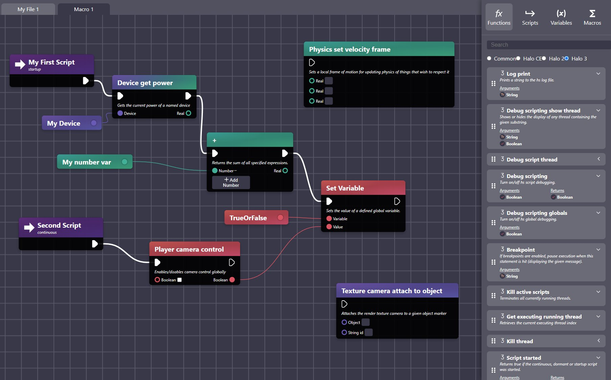
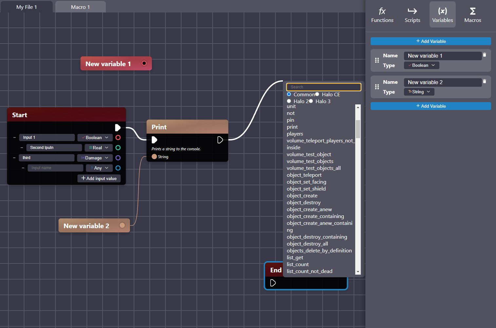

# React Scripting App

## Install
`yarn`

## Start
`yarn start`

If once started nothing appears in the Electron window, press command + R to refresh the UI.

## Description

This is a visual scripting editor for the halo scripting language.

It supports node connections, variable management, macros and much more.

It generates the scripts from the nodes graph.

